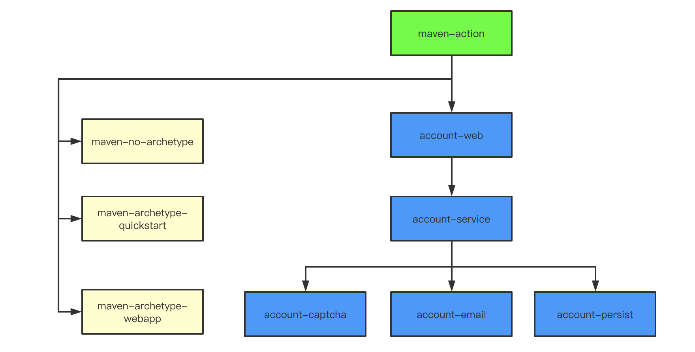

# Maven Action

新建 maven 项目优先使用 maven-archetype-quickstart 原型  

maven 常用命令
```shell script
# 编译指定module
mvn clean package -pl <module>

# 编译指定module, 以及它依赖的module
mvn clean package -pl <module> -am

# 编译指定module, 以及依赖它的module
mvn clean package -pl <module> -amd
```

项目结构图  
  

